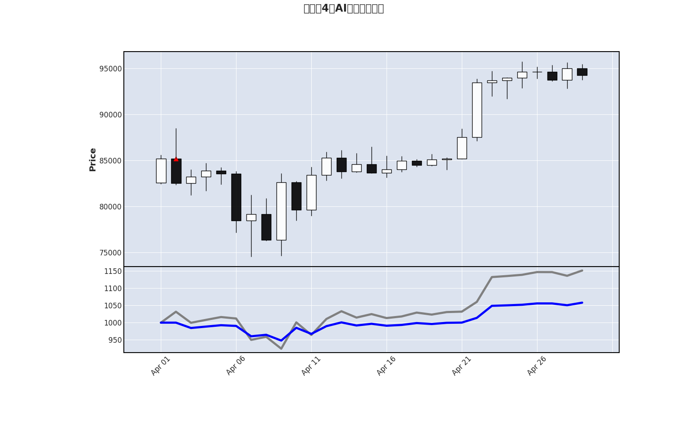
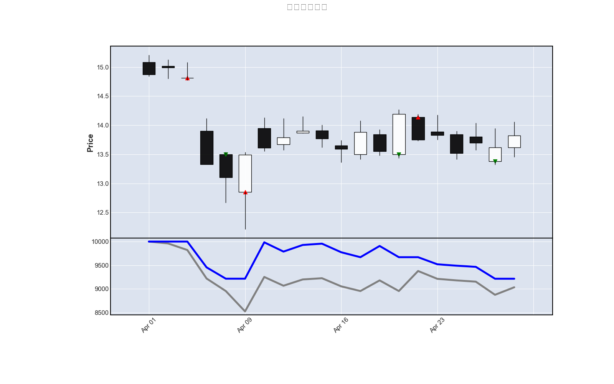

# 项目介绍
这是一个量化交易框架，支持
- AI股价/新闻分析并对当天交易做出决策
- 加密货币自动交易
- 自定义策略与策略回测

## 测试

本项目包含两类测试：

### 单元测试（默认运行）
这些测试使用Mock对象，运行速度快，用于验证代码逻辑的正确性：

```bash
# 运行所有单元测试
pytest

# 运行特定测试文件
pytest test/test_agent_tool_call.py

# 运行时显示详细信息
pytest -v
```

### 集成测试（需要手动运行）
这些测试使用真实的API调用，需要网络连接和有效的API配置，默认不会运行：

```bash
# 只运行集成测试
pytest -m integration

# 运行特定的集成测试类
pytest test/test_agent_tool_call.py::TestAgentWithRealPaoluzProvider

# 运行集成测试并显示详细信息
pytest -m integration -v
```

### 测试配置说明
- 集成测试被标记为 `@pytest.mark.integration`，默认被排除在常规测试运行之外
- 慢速测试被标记为 `@pytest.mark.slow`
- 配置文件 `pytest.ini` 中设置了默认过滤规则

### Agent工具调用测试
项目包含完整的Agent工具调用功能测试：
- **Mock测试**：快速验证工具注册、调用逻辑和错误处理
- **集成测试**：使用真实的Paoluz Provider验证端到端功能，包括：
  - 真实API调用
  - 工具注册和执行
  - 多轮对话上下文管理
  - 错误处理机制

运行集成测试需要在 `.env` 文件中配置有效的 `PAOLUZ_AI_TOKEN`。

## 依赖安装

### 使用 Docker 安装
1. 确保已安装 Docker。
2. 构建 Docker 镜像：
   ```bash
   docker build -t ai-quant .
   ```
3. 运行容器并进入 Bash：
   ```bash
   docker run -it -v ~/quant.sqlite:/app/quant.sqlite ai-quant bash
   ```

### 正常安装步骤
1. 安装 Python 3.12 或更高版本。
2. 安装 TA-Lib C 库：
   ```bash
   wget https://github.com/ta-lib/ta-lib/releases/download/v0.6.4/ta-lib-0.6.4-src.tar.gz
   tar -xzf ta-lib-0.6.4-src.tar.gz
   cd ta-lib-0.6.4/
   ./configure --prefix=/usr
   make
   sudo make install
   cd ..
   rm -rf ta-lib-0.6.4 ta-lib-0.6.4-src.tar.gz
   ```
   如果是在windows下，可以直接访问https://github.com/cgohlke/talib-build/releases下载whl包，并直接`pip install`
3. 安装 Python 依赖：
   ```bash
   pip install --no-cache-dir -r requirements.txt
   ```

4. 安装本项目:
    ```bash
    pip install -e .
    ```
## 运行配置
创建一个.env文件，在其中配置环境变量，支持哪些环境变量可以在[config.py](./lib/config.py)查看

下面是一个Example
```.env
LOG_LEVEL=INFO
CREATE_TABLE=TRUE
PUSH_PLUS_TOKEN='' # 用于接收定时任务消息结果
SILICONFLOW_TOKEN='' # 硅基流动模型token
PAOLUZ_AI_TOKEN='' # 某大模型供应商的token
BAI_CHUAN_TOKEN='' # 百川大模型
```
申请硅基流动大模型令牌：https://siliconflow.cn/

申请PAOLUZ大模型令牌：https://chatapi.nloli.xyz

如果想支持其它大模型的Provider也非常简单，参考[siliconflow.py](./lib/adapter/llm/siliconflow.py), 只要是兼容OPENAI的大模型，都可以简单替换其中的参数实现

## 运行示例
### AI交易策略回测
#### 测试AI从今年4月1日到4月30日，本金1000USDT，操盘比特币

```
python3 scripts/gpt_trade_v2.py BTC/USDT "比特币4月AI模拟交易测试" 1000 \
    --start-time 2025-04-01 --end-time 2025-04-30 \
    --advice-model-provider siliconflow --advice-model deepseek-ai/DeepSeek-V3 \
    --news-summary-model-provider siliconflow --news-summary-model THUDM/glm-4-9b-chat \
    --risk-prefer 风险喜好型 --strategy-prefer 高抛低吸，见好就收，分批买入
```
这个程序会模拟从4月1号到4月29号币安交易所的BTC/USDT历史走势，模拟4月1号到4月29号每一天根据当时的历史数据、新闻进行分析，并做出决策，这个过程中，每一天都要总结历史新闻并结合历史数据做出决策，一次会调用两次大模型接口，4月1号到4月29号一共29天，所以一共要调用29 * 2 = 58次大模型接口，速度会比较慢。最终运行结果如下：

运行结果：
<div align="center">

</div>

其中灰色的线代表本金全部一次新投资的收益走势，蓝色的线代表AI操盘的收益，在这个图中，由于AI没有一次新投入所有本金，后面下跌的时候也没有加仓，币价总体呈上升趋势，所以收益没有跑赢梭哈的收益。

> 图片标题的地方显示中文不成功，忽略这个问题=-=

#### 测试AI从今年4月1日到4月30日，本金10000元，某支A股股票

```
python3 scripts/gpt_trade_v2.py 600588 "用友网络4月AI模拟交易测试" 10000 \
    --start-time 2025-04-01 --end-time 2025-04-30 \
    --advice-model-provider siliconflow --advice-model deepseek-ai/DeepSeek-V3 \
    --news-summary-model-provider siliconflow --news-summary-model THUDM/glm-4-9b-chat \
    --risk-prefer 稳健型 --strategy-prefer 跟进利好消息分批买入
```
<div align="center">

</div>